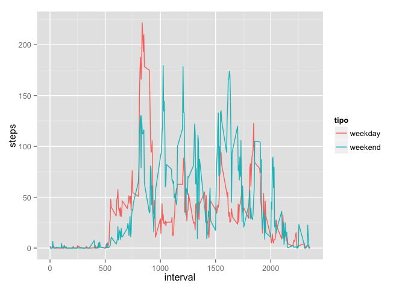

# Reproducible Research: Peer Assessment 1


## Loading and preprocessing the data

```r
library("data.table")
#Leemos el fichero:
activity <- read.csv("./activity.csv")
dt <- data.table(activity)
setkey(dt,date)
```


## What is mean total number of steps taken per day?
For this part of the assignment, you can ignore the missing values in the dataset.

- Calculate the total number of steps taken per day

```r
TotalStepsByDay <- dt[,sum(steps,na.rm=TRUE),by=date]
setnames(TotalStepsByDay,c("date","steps"))
```
- If you do not understand the difference between a histogram and a barplot, research the difference between them. Make a histogram of the total number of steps taken each day

```r
hist(TotalStepsByDay$steps,xlab = "Steps per day")
```

 

- Calculate and report the mean and median of the total number of steps taken per day

```r
media <- mean(TotalStepsByDay$steps)
media
```

```
## [1] 9354.23
```

```r
mediana <- median(TotalStepsByDay$steps)
mediana
```

```
## [1] 10395
```

## What is the average daily activity pattern?
Make a time series plot (i.e. type = "l") of the 5-minute interval (x-axis) and the average number of steps taken, averaged across all days (y-axis)

```r
AvgStepsPerMinute <- dt[,mean(steps,na.rm=TRUE),by=interval]
setnames(AvgStepsPerMinute,c("interval","steps"))
with(AvgStepsPerMinute, plot(steps ~ interval, type = "l"))
```

 
- Which 5-minute interval, on average across all the days in the dataset, contains the maximum number of steps?

```r
AvgStepsPerMinute[which.max(AvgStepsPerMinute$steps),]
```

```
##    interval    steps
## 1:      835 206.1698
```

## Imputing missing values
Note that there are a number of days/intervals where there are missing values (coded as NA). The presence of missing days may introduce bias into some calculations or summaries of the data.

- Calculate and report the total number of missing values in the dataset (i.e. the total number of rows with NAs)

```r
dtNAs <- data.table(dt[!complete.cases(dt),])
dtNAs
```

```
##       steps       date interval
##    1:    NA 2012-10-01        0
##    2:    NA 2012-10-01        5
##    3:    NA 2012-10-01       10
##    4:    NA 2012-10-01       15
##    5:    NA 2012-10-01       20
##   ---                          
## 2300:    NA 2012-11-30     2335
## 2301:    NA 2012-11-30     2340
## 2302:    NA 2012-11-30     2345
## 2303:    NA 2012-11-30     2350
## 2304:    NA 2012-11-30     2355
```
- Devise a strategy for filling in all of the missing values in the dataset. The strategy does not need to be sophisticated. For example, you could use the mean/median for that day, or the mean for that 5-minute interval, etc.

```r
#Merge dtNAs with AvgStepsPerMinute
dtNAsMerged <- merge(dtNAs,AvgStepsPerMinute,by="interval")
dtNAsMerged[,steps.x:=NULL]
```

```
##       interval       date  steps.y
##    1:        0 2012-10-01 1.716981
##    2:        0 2012-10-08 1.716981
##    3:        0 2012-11-01 1.716981
##    4:        0 2012-11-04 1.716981
##    5:        0 2012-11-09 1.716981
##   ---                             
## 2300:     2355 2012-11-04 1.075472
## 2301:     2355 2012-11-09 1.075472
## 2302:     2355 2012-11-10 1.075472
## 2303:     2355 2012-11-14 1.075472
## 2304:     2355 2012-11-30 1.075472
```

```r
setnames(dtNAsMerged, c("interval","date","steps"))
dtNAsMerged
```

```
##       interval       date    steps
##    1:        0 2012-10-01 1.716981
##    2:        0 2012-10-08 1.716981
##    3:        0 2012-11-01 1.716981
##    4:        0 2012-11-04 1.716981
##    5:        0 2012-11-09 1.716981
##   ---                             
## 2300:     2355 2012-11-04 1.075472
## 2301:     2355 2012-11-09 1.075472
## 2302:     2355 2012-11-10 1.075472
## 2303:     2355 2012-11-14 1.075472
## 2304:     2355 2012-11-30 1.075472
```
- Create a new dataset that is equal to the original dataset but with the missing data filled in.

```r
newdt <- data.table(rbind(dt[complete.cases(dt)],dtNAsMerged))
newdt
```

```
##           steps       date interval
##     1: 0.000000 2012-10-02        0
##     2: 0.000000 2012-10-02        5
##     3: 0.000000 2012-10-02       10
##     4: 0.000000 2012-10-02       15
##     5: 0.000000 2012-10-02       20
##    ---                             
## 17564: 1.075472 2012-11-04     2355
## 17565: 1.075472 2012-11-09     2355
## 17566: 1.075472 2012-11-10     2355
## 17567: 1.075472 2012-11-14     2355
## 17568: 1.075472 2012-11-30     2355
```
- Make a histogram of the total number of steps taken each day and Calculate and report the mean and median total number of steps taken per day. Do these values differ from the estimates from the first part of the assignment? What is the impact of imputing missing data on the estimates of the total daily number of steps?

```r
#aggregate data
TotalStepsByDay <- newdt[,sum(steps),by=date]
setnames(TotalStepsByDay,c("date","steps"))
TotalStepsByDay
```

```
##           date    steps
##  1: 2012-10-02   126.00
##  2: 2012-10-03 11352.00
##  3: 2012-10-04 12116.00
##  4: 2012-10-05 13294.00
##  5: 2012-10-06 15420.00
##  6: 2012-10-07 11015.00
##  7: 2012-10-09 12811.00
##  8: 2012-10-10  9900.00
##  9: 2012-10-11 10304.00
## 10: 2012-10-12 17382.00
## 11: 2012-10-13 12426.00
## 12: 2012-10-14 15098.00
## 13: 2012-10-15 10139.00
## 14: 2012-10-16 15084.00
## 15: 2012-10-17 13452.00
## 16: 2012-10-18 10056.00
## 17: 2012-10-19 11829.00
## 18: 2012-10-20 10395.00
## 19: 2012-10-21  8821.00
## 20: 2012-10-22 13460.00
## 21: 2012-10-23  8918.00
## 22: 2012-10-24  8355.00
## 23: 2012-10-25  2492.00
## 24: 2012-10-26  6778.00
## 25: 2012-10-27 10119.00
## 26: 2012-10-28 11458.00
## 27: 2012-10-29  5018.00
## 28: 2012-10-30  9819.00
## 29: 2012-10-31 15414.00
## 30: 2012-11-02 10600.00
## 31: 2012-11-03 10571.00
## 32: 2012-11-05 10439.00
## 33: 2012-11-06  8334.00
## 34: 2012-11-07 12883.00
## 35: 2012-11-08  3219.00
## 36: 2012-11-11 12608.00
## 37: 2012-11-12 10765.00
## 38: 2012-11-13  7336.00
## 39: 2012-11-15    41.00
## 40: 2012-11-16  5441.00
## 41: 2012-11-17 14339.00
## 42: 2012-11-18 15110.00
## 43: 2012-11-19  8841.00
## 44: 2012-11-20  4472.00
## 45: 2012-11-21 12787.00
## 46: 2012-11-22 20427.00
## 47: 2012-11-23 21194.00
## 48: 2012-11-24 14478.00
## 49: 2012-11-25 11834.00
## 50: 2012-11-26 11162.00
## 51: 2012-11-27 13646.00
## 52: 2012-11-28 10183.00
## 53: 2012-11-29  7047.00
## 54: 2012-10-01 10766.19
## 55: 2012-10-08 10766.19
## 56: 2012-11-01 10766.19
## 57: 2012-11-04 10766.19
## 58: 2012-11-09 10766.19
## 59: 2012-11-10 10766.19
## 60: 2012-11-14 10766.19
## 61: 2012-11-30 10766.19
##           date    steps
```

```r
#histogram
hist(TotalStepsByDay$steps,xlab = "Steps per day")
```

 

```r
newmedia <- mean(TotalStepsByDay$steps)
newmedia
```

```
## [1] 10766.19
```

```r
newmediana <- median(TotalStepsByDay$steps)
newmediana
```

```
## [1] 10766.19
```

## Are there differences in activity patterns between weekdays and weekends?
For this part the weekdays() function may be of some help here. Use the dataset with the filled-in missing values for this part.

- Create a new factor variable in the dataset with two levels – “weekday” and “weekend” indicating whether a given date is a weekday or weekend day.

```r
newdt$date <- as.Date(newdt$date,"%Y-%m-%d")
auxWeekDays <- c("lunes","martes","miÈrcoles","jueves","viernes","s·bado","domingo")
auxLaborables <- c("weekday","weekday","weekday","weekday","weekday","weekend","weekend")
dtWeekDays <- data.table(auxWeekDays,auxLaborables)
setnames(dtWeekDays,c("dia","tipo"))
dtWeekDays
```

```
##          dia    tipo
## 1:     lunes weekday
## 2:    martes weekday
## 3: miÈrcoles weekday
## 4:    jueves weekday
## 5:   viernes weekday
## 6:    s·bado weekend
## 7:   domingo weekend
```

```r
newdt$dia <- weekdays(newdt$date)
newdt <- merge(newdt,dtWeekDays,by="dia")
```

```
## Warning in bmerge(i <- shallow(i), x, leftcols, rightcols, io <-
## haskey(i), : A known encoding (latin1 or UTF-8) was detected in a join
## column. data.table compares the bytes currently, so doesn't support
## *mixed* encodings well; i.e., using both latin1 and UTF-8, or if any
## unknown encodings are non-ascii and some of those are marked known and
## others not. But if either latin1 or UTF-8 is used exclusively, and all
## unknown encodings are ascii, then the result should be ok. In future we
## will check for you and avoid this warning if everything is ok. The tricky
## part is doing this without impacting performance for ascii-only cases.
```

```r
StepsPerDayType <- newdt[,mean(steps),by=c("interval","tipo")]
setnames(StepsPerDayType,c("interval","tipo","steps"))
StepsPerDayType
```

```
##      interval    tipo       steps
##   1:        0 weekend 0.214622642
##   2:        5 weekend 0.042452830
##   3:       10 weekend 0.016509434
##   4:       15 weekend 0.018867925
##   5:       20 weekend 0.009433962
##  ---                             
## 572:     2335 weekday 1.930293501
## 573:     2340 weekday 2.708595388
## 574:     2345 weekday 0.089098532
## 575:     2350 weekday 0.142557652
## 576:     2355 weekday 0.927148847
```
- Make a panel plot containing a time series plot (i.e. type = "l") of the 5-minute interval (x-axis) and the average number of steps taken, averaged across all weekday days or weekend days (y-axis). See the README file in the GitHub repository to see an example of what this plot should look like using simulated data.

```r
library(ggplot2)
qplot(interval,steps,data=StepsPerDayType,geom="line",color=tipo)
```

 
